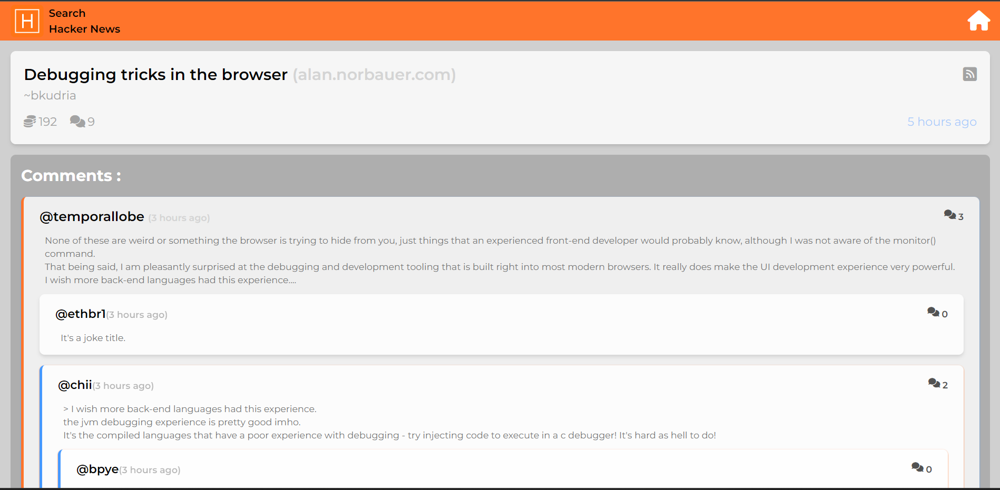
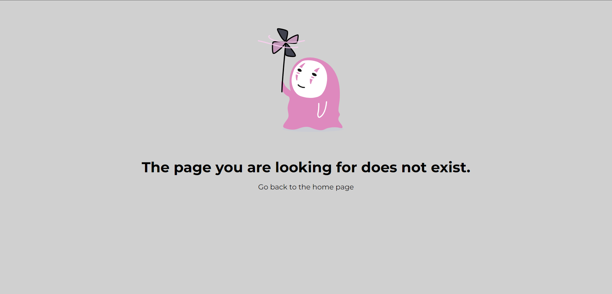
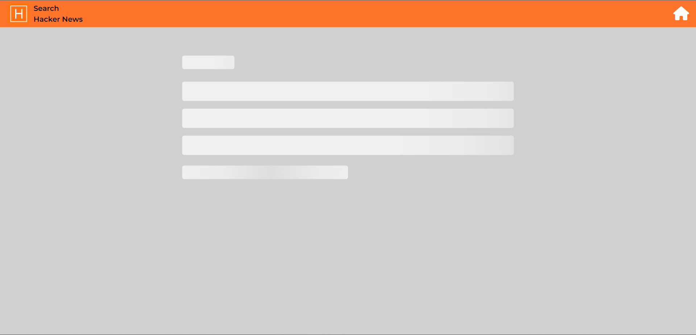

# Hacker News Search

Hacker News Search is a web application built with React that allows users to search for posts on Hacker News. The application utilizes the Hacker News API to fetch and display search results, providing users with a clean and interactive interface.

## Features

- **Search Functionality:** Search for posts on Hacker News based on keywords.
- **Filter Options:** Apply filters such as post type (story, comment, poll, etc.) to refine search results.
- **Post Details:** Click on a search result to view detailed information about a post, including comments and their nested replies.
- **Responsive Design:** The application is designed to be responsive, ensuring a seamless experience across different devices.

## Getting Started

Follow these instructions to get a copy of the project up and running on your local machine for development and testing purposes.

### Prerequisites

- Node.js and npm installed on your machine.

### Installation

1. Clone the repository:

    git clone git@github.com:ashutoshgairola/Hybr1d-assignment.git

2. Change into the project directory:

    cd hacker-news-search

3. Install dependencies:

    npm install

4. Start the development server:

    npm run dev

### Usage

1. Access the application in your web browser.
2. Use the search bar on the HomePage to enter keywords and perform searches.
3. Apply filters to refine your search results.
4. Click on a search result to view detailed information about the post, including comments and their replies.

### Built With

- React - A JavaScript library for building user interfaces.
- Hacker News API - API for Hacker News.

### Libraries Used

- React: A JavaScript library for building user interfaces.
- React Router: For handling navigation and routing in the application.
- Axios: A promise-based HTTP client for making API requests.
- JavaScript Time Ago: A library for formatting timestamps into a human-readable "time ago" format.
- Lottie: A library for rendering After Effects animations in the web.
- Tailwind CSS: A utility-first CSS framework for styling the application.

### Project Structure

The project is organized into the following main directories:

- **assets:** Contains assets such as images, icons, and animations used in the application.

- **components:** Reusable React components used throughout the application. Each component is designed for a specific purpose, making the code modular and easy to maintain.

- **pages:** The main pages of the application, each serving a distinct purpose.

  - **HomePage:** Displays the search bar and search results.
  
  - **Post:** Displays detailed information about a post, including comments and replies.
  
  - **ErrorPage:** Renders an error message when an unexpected error occurs.

- **service:** The `searchService` module is responsible for handling API requests to the Hacker News API.

### Project Entry Points

- **index.jsx:** The main entry point of the React application, responsible for rendering the `App` component.

- **App.jsx:** The main component that serves as the entry point for the application. It manages the overall layout and navigation.

## Project Screenshots

Include screenshots of the UI to provide a visual representation of your project.

### HomePage

### Post Page

### ErrorPage

### LoadingPage

